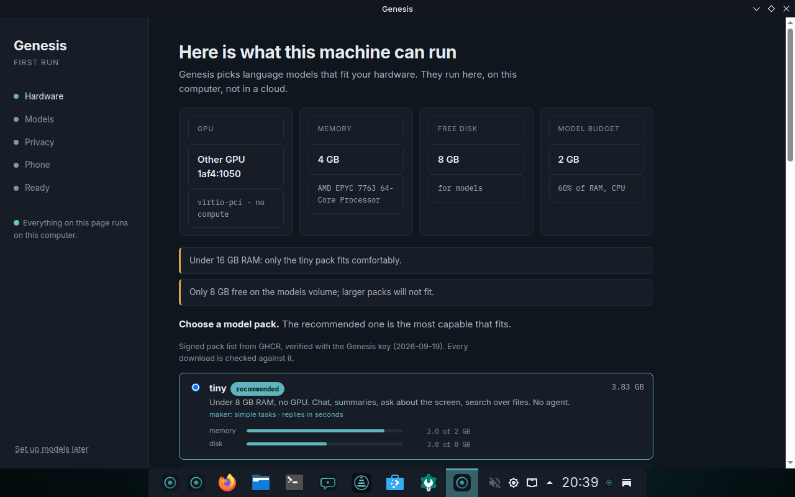
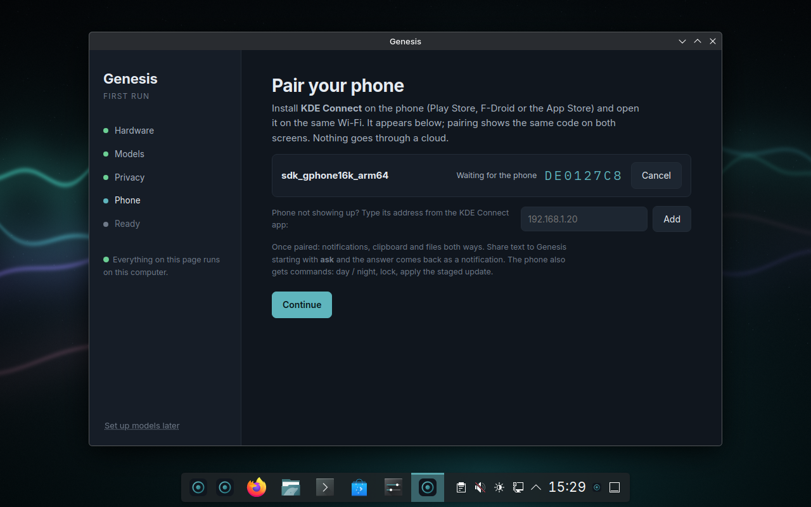
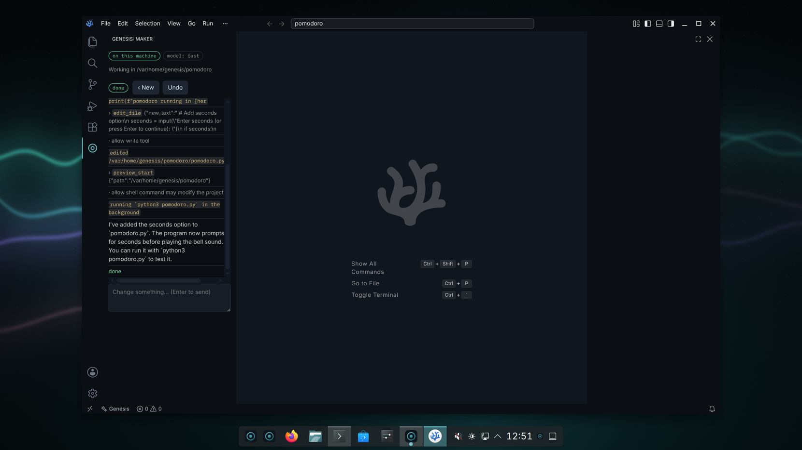
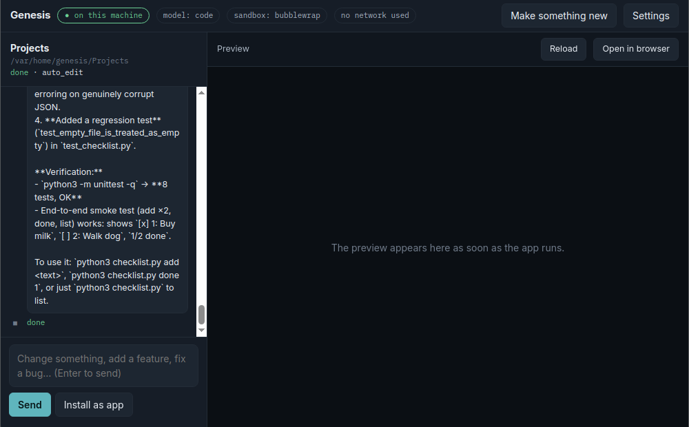
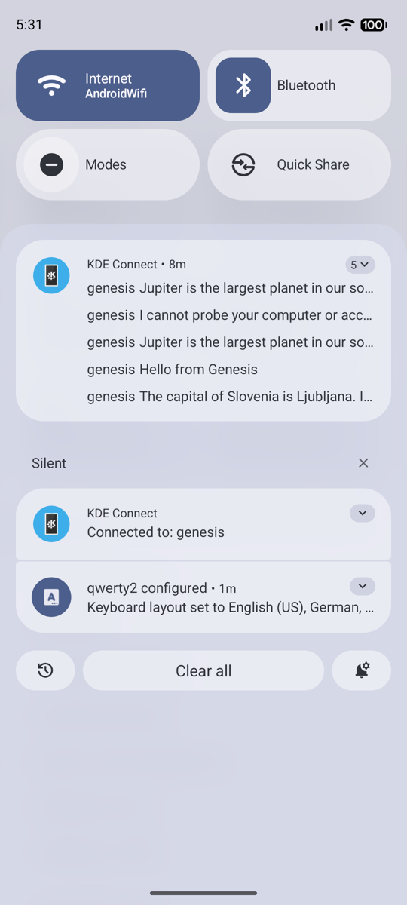
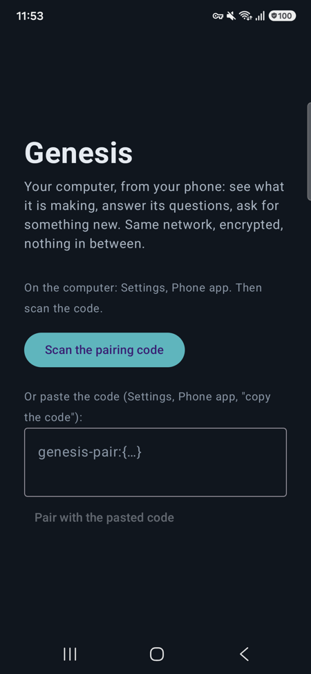
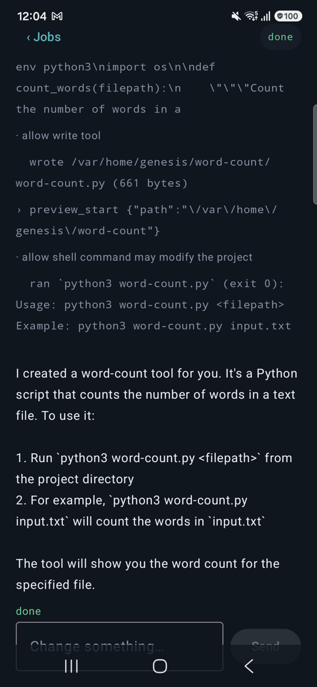
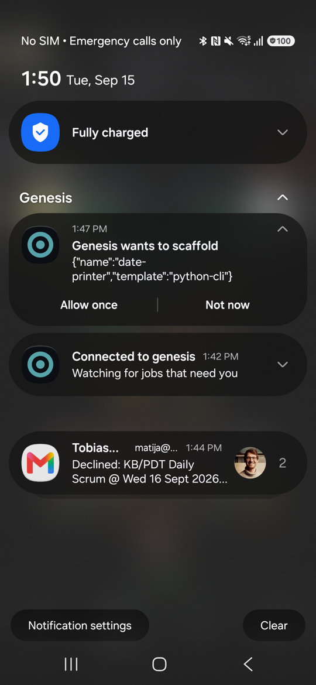
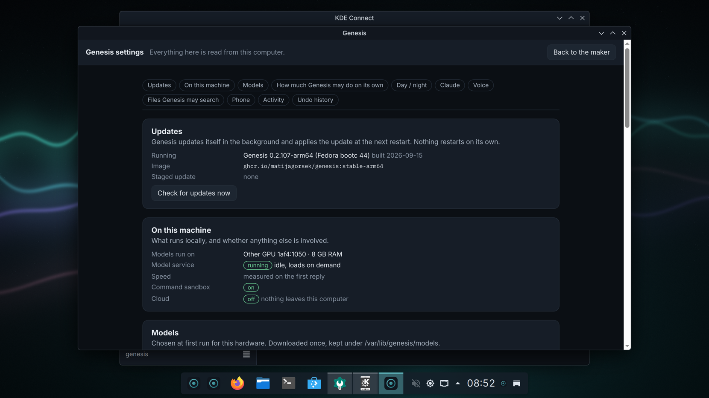

# How to use Genesis

The user guide. For installing, see the [download page](https://matijagorsek.github.io/genesis/); for the project itself, the [README](README.md).

Genesis is a normal desktop first. Everything below is optional and lives behind one key, Meta+Space
(the Windows or Command key, plus Space). Nothing here needs an account, and nothing leaves the machine
unless you choose it.

## First run

The first time you log in, a window asks three things:

1. **Which models.** Genesis measures the machine and recommends the biggest model pack that fits. Take
   the recommended one; it downloads in the background (about 2 GB for the smallest, more for GPUs).
   You can keep using the desktop meanwhile.
2. **Privacy.** Local only is the default. Leave it.
3. **Your phone.** Optional. Install KDE Connect on the phone, same Wi-Fi, accept the code on both
   screens. You can do this later from Settings.

At the end, pick something to make, or don't. If you skipped models, "Set up models" in the app menu
brings the window back.

## Make something

Press Meta+Space, type what you want in plain words, Enter.

- "a checklist app that saves to a file"
- "a pomodoro timer with a bell"
- "rename the photos in this folder by the date they were taken"

The maker window shows every step as it happens. A preview appears when the thing runs. When it is
done: **Install as app** puts it in the app menu; **Open in browser** for web things; the folder is
under your home, named after the project.

**Steer it:** type in the box at the bottom ("make the button bigger", "add a dark mode") and Enter.

**Speed:** on a machine without a GPU, a step can take minutes. The line under the steps tells you
how long the current one has run. It is working, not stuck.

## When it asks

Before anything that changes your machine outside the project, a card appears with a plain verb:
"Genesis wants to install a package", "wants to write to your Documents". Choose:

- **Allow once**
- **Allow for this project**
- **Not now**

Some things it never does, whatever you answer: read your keys and passwords, wipe disks, change the
base system. Those are refused by the rules, not by the model.

**How much on its own:** Settings > "How much Genesis may do on its own". *Assist* asks before every
change. *Auto edit* (default) edits the project freely and asks for the rest. *Hands-off* also handles
installs and user settings on its own; things that touch the system still ask.

## Undo

Every job that changed something outside its project ends with **Keep / Undo**. Later, Settings >
Undo history lists those jobs with an Undo button. In a terminal, `genesis-txd list` and
`genesis-txd undo <id>` do the same.

## Babel, the IDE

Babel is in the dock and the app menu: a full code editor (Code-OSS, so every language, debugger and
extension VS Code has), with Genesis built in.

- **Genesis in the sidebar** (the ring icon): type what should change in the open folder, watch the
  steps, answer the cards, steer, undo. It is the same maker, working on the folder you have open.
- **Right-click in the editor**: "Ask about the selection" explains the selected code in the Genesis
  output panel; "Change this file…" asks for a change to just that file.
- **Ctrl+Alt+Space** anywhere in Babel: make something in this workspace.

## Ask, anywhere

- **Meta+Space**, type a question instead of a request; the answer appears in the same window.
- **Select text** in any app, press Meta+Shift+Space: ask about the selection.
- **Meta+Shift+A**: select a region of the screen and ask what it is; the answer arrives as a
  notification and is copied to the clipboard.
- **Terminal:** `ask how do I find large files` answers in the shell; Ctrl+G turns the line you typed
  into a command.
- **Your files:** Settings > "Files Genesis may search", add a folder (Documents, Notes). Then "what did I
  write about the trip?" finds it. Only the folders you add are read.

## Voice

Hold the microphone button in the maker or the palette, speak, release. The transcript appears before
anything runs. Replies can be spoken back (toggle in the window). Speech recognition understands many
languages; spoken replies are English for now.

## Your phone

After pairing with KDE Connect:

- share any text to Genesis starting with **ask** and the answer comes back as a notification;
- send a voice memo to Genesis and it is transcribed and answered the same way;
- in KDE Connect, open the "genesis" device and use **Run Command** for day / night, lock the screen, or
  "Ask Genesis what I just shared";
- on Android, the palette shows your phone's notifications and can reply to those that allow it.

If the phone does not find the computer, type the phone's address into Settings > Phone; the computer
starts the connection instead.

  

**The Genesis app (Android).** Settings > Phone app shows a code; scan it with the app (or copy and
paste it). From then on the phone shows your jobs, lets you answer permission cards, start a make, see what was
made and fetch one screenshot of the computer. When a job waits for your answer, the phone gets a
notification with **Allow once** and **Not now** right on it; a quiet "Connected to genesis"
notification stays while the app watches. Same network, encrypted to this machine only; "Regenerate the
code" unpairs every phone.

## Updates

Genesis fetches updates in the background and stages them; nothing restarts on its own. The dock's
status widget and Settings > Updates say when one is ready; **Apply at next restart** is a click, and
every update can be rolled back from the boot menu.

## Day and night

Settings > Day / night, or say "dark mode" to the microphone. The desktop, the terminal and the
maker switch together.

## Claude Code, with your own account

If you have a Claude subscription: Settings > "Claude, with your account" opens Claude Code in a
terminal, signed in with your login, working in the same project folders. Nothing of it is used
unless you open it.

## When something is wrong

- **"No models yet" in the maker:** the download did not finish or the model service is starting.
  App menu > Set up models.
- **The maker says the model is unreachable:** wait a minute after login, then try again; Settings >
  "On this machine" shows whether the model service runs.
- **A step runs for very long:** on CPU-only machines the bigger packs are slow. The tiny pack answers
  in seconds; choose it under Set up models.
- **Something changed that you did not want:** Settings > Undo history.
- **Report:** GitHub issues, "Hardware report" or "Bug" template. `genesis-image-check` in a terminal
  prints a self-check you can paste.
