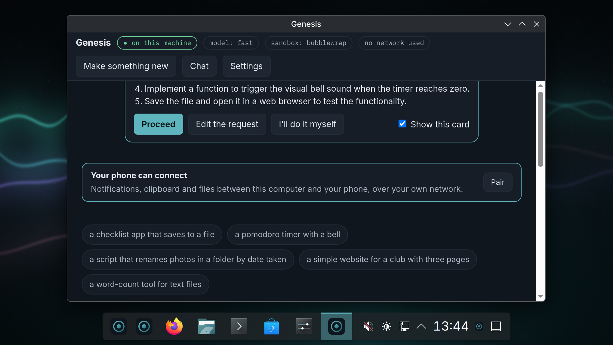
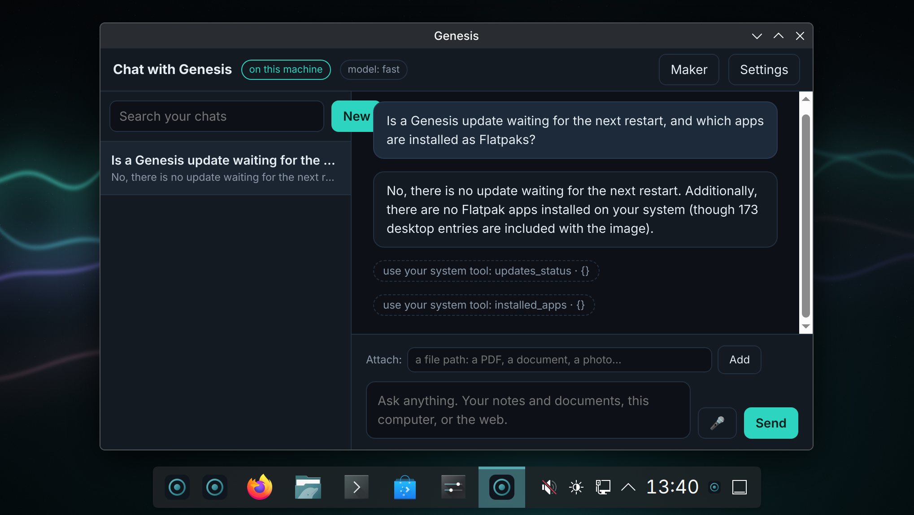

# How to use Genesis

The user guide. For installing, see the [download page](https://matijagorsek.github.io/genesis/); for the project itself, the [README](README.md).

<p align="center"></p>

Genesis is a normal desktop first. Everything below is optional and lives behind one key, Meta+Space
(the Windows or Command key, plus Space). Nothing here needs an account, and nothing leaves the machine
unless you choose it.

## First run

The small model comes first and the maker starts the moment it is on disk, while the rest of the pack
keeps downloading behind it.

<p align="center"></p>

The first time you log in, a window asks three things:

1. **Which models.** Genesis measures the machine and recommends the biggest model pack that fits. Take
   the recommended one; it downloads in the background (about 2 GB for the smallest, more for GPUs).
   You can keep using the desktop meanwhile.
2. **Privacy.** Local only is the default. Leave it.
3. **Your phone.** Optional. Install KDE Connect on the phone, same Wi-Fi, accept the code on both
   screens. You can do this later from Settings.


<p align="center"></p>

At the end, pick something to make, or don't. If you skipped models, "Set up models" in the app menu
brings the window back.

## Make something

<p align="center"></p>

Press Meta+Space, type what you want in plain words, Enter.

- "a checklist app that saves to a file"
- "a pomodoro timer with a bell"
- "rename the photos in this folder by the date they were taken"

The maker window shows every step as it happens. A preview appears when the thing runs. When it is
done: **Install as app** puts it in the app menu; **Open in browser** for web things; the folder is
under your home, named after the project.

**Steer it:** type in the box at the bottom ("make the button bigger", "add a dark mode") and Enter.

**Speed:** on a machine without a GPU, a step can take minutes. The line under the steps tells you
how long the current one has run. It is working, not stuck.

### Modes, from anywhere

`Meta+Shift+M` cycles Ask, Trusted and Hands-off; the status widget in the dock shows the current
mode and has a Cycle button. Settings, "Always and never" keeps your own rules: a command pattern
marked always runs without asking in every mode, one marked never is refused everywhere.

### The card before it starts



In Ask and Trusted modes a card appears before anything runs: what the job will touch (the project
folder, the network, installing software, files outside the project) and the steps Genesis intends
to take. Proceed, edit the request, or do it yourself. Untick "Show this card" to skip it; Hands-off
never shows it.

## When it asks

Before anything that changes your machine outside the project, a card appears with a plain verb:
"Genesis wants to install a package", "wants to write to your Documents". Choose:

- **Allow once**
- **Allow for this project**
- **Not now**

Some things it never does, whatever you answer: read your keys and passwords, wipe disks, change the
base system. Those are refused by the rules, not by the model.

**How much on its own:** Settings > "How much Genesis may do on its own". *Assist* asks before every
change. *Auto edit* (default) edits the project freely and asks for the rest. *Hands-off* also handles
installs and user settings on its own; things that touch the system still ask.

## Undo

Every job that changed something outside its project was snapshotted first. The maker's toast offers
Undo right after a job; Settings, Undo history lists every job. **Changes** on a job shows what it did
file by file, with the lines before and after, and **Restore just this file** puts one file back
without undoing the rest. Undo takes the whole job back.

## Babel, the IDE

<p align="center"></p>
<p align="center"></p>

Babel is in the dock and the app menu: a full code editor (Code-OSS, so every language, debugger and
extension VS Code has), with Genesis built in. Python, JavaScript and TypeScript, Rust, Go and C/C++
understand your code out of the box: completion, errors, go to definition, and debugging (Python,
Rust, Go, C/C++); the language servers and debuggers are part of the image, nothing is downloaded on
first use.

- **Genesis in the sidebar** (the ring icon): type what should change in the open folder, watch the
  steps, answer the cards, steer, undo. It is the same maker, working on the folder you have open.
- **Right-click in the editor**: "Ask about the selection" explains the selected code in the Genesis
  output panel; "Change this file…" asks for a change to just that file.
- **Ctrl+Alt+Space** anywhere in Babel: make something in this workspace.
- **Made here** in the sidebar lists everything Genesis built; one click opens it in Babel. The maker's
  gallery has "Open in Babel" too.

### Suggestions while you type

Babel suggests the next lines as you write, in every language, from the small model on this machine. The
suggestion appears in grey; `Tab` takes it, keep typing to ignore it. The status bar says which model is
answering ("fast completion") and one click turns it off. Packs with a dedicated completion model use
that; the others use the always-loaded small model, so the first suggestion after a pause takes a few
seconds on CPU-only machines and is quick once the file is warm. Nothing leaves the computer.

## Chat



Not everything is a thing to build. **Chat with Genesis** in the app menu (or the Chat button in the
maker) is an ordinary conversation that stays on this machine: ask what you wrote about a trip, what a
term means, whether an update is waiting, which apps are installed. Every chat is kept and the list on
the left searches all of them. Attach a PDF, a document or a photo by its path and ask about it: text
is read from the file; a photo, or a scanned PDF with no text layer, is read by the local vision model
(a few pages at a time). When a question needs one of your tools
or a file outside your opted-in folders, the same permission card appears as in the maker.
The Templates button keeps prompts you use often; seven come with Genesis and yours are saved from the
composer.

**Fix my computer.** The templates include "My Wi-Fi is slow", "The printer does not print", "My battery
drains fast" and "My computer feels slow". Genesis diagnoses with its system tools, says what is wrong
in a sentence or two, and then offers the one fix it would try first as a card: reconnect the Wi-Fi,
set up the printer, print a test page, switch the power profile. Allow once, and it does it.

## The morning card

The first time the maker opens on a day, one card sums the machine up: an update waiting, things you
made yesterday that are not installed yet, a weak Wi-Fi, a low battery. Every line comes from a local
tool; "Got it" puts it away until tomorrow. The phone app shows the same card.

## Ask, anywhere

<p align="center"></p>

- **Meta+Space**, type a question instead of a request; the answer appears in the same window.
- **Select text** in any app, press Meta+Shift+Space: ask about the selection.
- **Meta+Shift+A**: select a region of the screen and ask what it is; the answer arrives as a
  notification and is copied to the clipboard.
- **Terminal:** `ask how do I find large files` answers in the shell; Ctrl+G turns the line you typed
  into a command.
- **Your files:** Settings > "Files Genesis may search", add a folder (Documents, Notes). Then "what did I
  write about the trip?" finds it, even when the note says "our week in Lisbon" and never "trip": the
  index searches by words and by meaning, with the small embedding model every pack ships. Only the
  folders you add are read, and nothing leaves the machine.

## Voice

Hold the mic in the palette, the maker or chat and speak; let go and the words appear. Replies can be
read aloud (the speaker button in the maker); `Esc` stops a reply mid-sentence. Spoken replies come in
the desktop's language: English, German and Slovenian voices ship with every pack. A spoken request
that would install, delete or send something is shown first and needs Enter, so a misheard word cannot
act on its own.

## Your phone

<p align="center"></p>

After pairing with KDE Connect:

- share any text to Genesis starting with **ask** and the answer comes back as a notification;
- send a voice memo to Genesis and it is transcribed and answered the same way;
- in KDE Connect, open the "genesis" device and use **Run Command** for day / night, lock the screen, or
  "Ask Genesis what I just shared";
- on Android, the palette shows your phone's notifications and can reply to those that allow it.

If the phone does not find the computer, type the phone's address into Settings > Phone; the computer
starts the connection instead.

<p align="center">  </p>

**The Genesis app (Android).** Settings > Phone app shows a code; scan it with the app (or copy and
paste it). From then on the phone shows your jobs, lets you answer permission cards, start a make, see what was
made and fetch one screenshot of the computer. When a job waits for your answer, the phone gets a
notification with **Allow once** and **Not now** right on it; a quiet "Connected to genesis"
notification stays while the app watches. Same network, encrypted to this machine only; "Regenerate the
code" unpairs every phone.

**One thing, two screens.** A make started on the phone shows up under Recent in the maker and can be
continued there; a make started at the desk shows its steps and cards on the phone. In the palette,
**To phone** sends the typed text or the current selection to the phone as a KDE Connect share.
Share any text or link *to* the Genesis app on the phone and it opens on the desktop: a link in the
browser, text in the palette.

The app comes as a signed APK on every release once the signing key is in the repository's secrets
(see `.github/workflows/android.yml`); until then it is built from `android/`.


## Your own tools (MCP)

The maker's abilities are not fixed. Any program that speaks MCP, the open Model Context Protocol, can
give it new tools, and Genesis ships one: the **system** server, which lets the maker read the
machine's status, network and updates, search Flathub and install or remove apps, find and set up
printers, say why the wifi is slow, switch the power profile, show Bluetooth and audio, and switch day
and night. Ask "install VLC" or "is an update waiting?" and the maker uses them, with the
same permission cards as everything else: installing is a system change and asks first, searching the
catalogue is network use, reading status is free.

Settings, Tools shows every server, whether it runs, and each tool's tier. To add your own, put it in
`~/.config/genesis/mcp.json` and press Reload:

```json
{"servers": {"notes": {"command": "/home/you/bin/notes-mcp", "tier": "read",
                       "tiers": {"add_note": "write"}, "description": "my notes"}}}
```

The tier is what the permission rules apply to every tool of that server: `read`, `write`, `network`,
`system` or `never`, per tool if you list them. The server runs as you, like any program you start.
The shipped one, `/usr/bin/genesis-mcp-system`, is 120 lines of Python and a fine template.

## Backup, and moving to a new machine

Settings > Backup and moving > **Export to Downloads** writes one file with everything Genesis made
and knows about you: the projects with their recipes, your Genesis settings, the folders you opted in
for search, the phone pairings and the undo history. No models (they download again), no keys, no
passwords. On a new Genesis, put the file anywhere in your home folder and use **Restore**; existing
projects are kept, restored ones get a "-restored" suffix if a name is taken. Pair the phone again
afterwards. In a terminal: `genesis-backup export`, `genesis-backup restore <file>`.

## Make it while I sleep

Type a request in the maker and press **Tonight** instead of Make it. Queued requests run one after
another at the time shown (23:00 by default), only on mains, in Trusted mode with every permission
card answered "not now", so a job stays inside its project. Start now runs the queue immediately.
The morning card says how many finished; the results are in Made here.

## Recipes: what to make, step by step

The maker's start page has a **Recipes** row: a few that ship with Genesis (a checklist app, a
pomodoro timer, a website for a club, a CLI grown in three steps…) and your own. One click replays the
steps, with the same permission cards. In the gallery, **Save recipe** keeps a made project's steps
under Recipes; **Copy recipe** puts them on the clipboard to send to someone, who pastes them into
"Make this from a recipe". Right-click one of your recipes to delete it. **Export** bundles the files
with the recipe, as one archive.

## Updates

<p align="center"></p>

Genesis fetches updates in the background and stages them; nothing restarts on its own. The dock's
status widget and Settings > Updates say when one is ready; **Apply at next restart** is a click, and
every update can be rolled back from the boot menu.

## Day and night

Settings > Day / night, or say "dark mode" to the microphone. The desktop, the terminal and the
maker switch together.

## Your language, and screen readers

The first-run wizard, the maker, chat, the palette, Genesis Settings and Babel's welcome follow the
language of your desktop: German and Slovenian are complete, English is the source. Anything not yet translated stays in English rather than
disappearing. To help with another language, see CONTRIBUTING.md.

A screen reader works with all of Genesis: turn it on in System Settings, Accessibility, Screen Reader
(Orca), and every button in the maker, the palette and Settings reads its purpose, including which
project a "Continue" or "Open in Babel" button belongs to. The dictation field says what it wants,
and the mic button says "Hold to talk".

## Apps that speak Ollama

Many editors and desktop apps can use "a local Ollama". Genesis answers that API on
`127.0.0.1:11434` from the same models the maker uses, so those apps work without installing
anything: point them at the default Ollama address and pick the model `fast` (or `code`, `chat`,
`embed` on packs that have them). Nothing leaves the machine; the door is local only.

## Claude Code, with your own account

If you have a Claude subscription: Settings > "Claude, with your account" opens Claude Code in a
terminal, signed in with your login, working in the same project folders. Nothing of it is used
unless you open it.

## When something is wrong

- **"No models yet" in the maker:** the download did not finish or the model service is starting.
  App menu > Set up models.
- **The maker says the model is unreachable:** wait a minute after login, then try again; Settings >
  "On this machine" shows whether the model service runs.
- **A step runs for very long:** on CPU-only machines the bigger packs are slow. The tiny pack answers
  in seconds; choose it under Set up models.
- **Something changed that you did not want:** Settings > Undo history.
- **Report:** GitHub issues, "Hardware report" or "Bug" template. `genesis-image-check` in a terminal
  prints a self-check you can paste.
