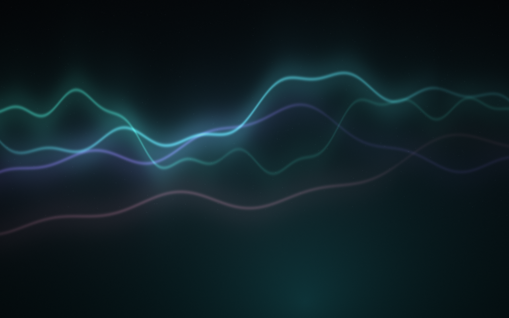
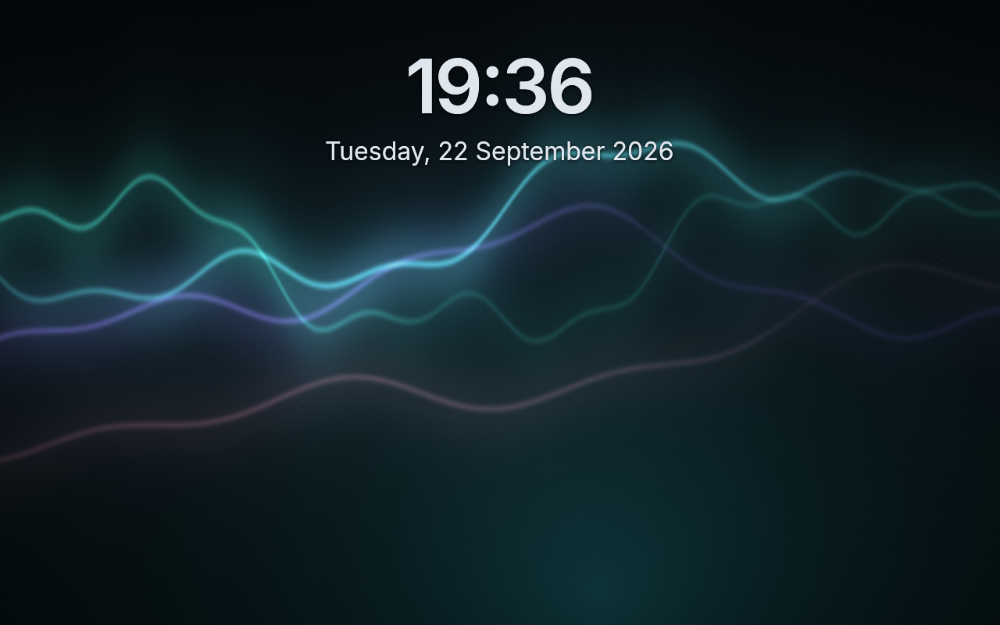
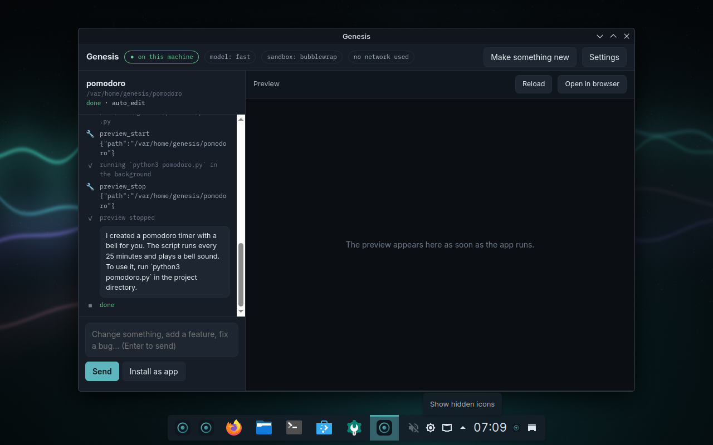

# Genesis

**A complete Linux desktop that can build things for you, with AI that runs on your machine.**

Genesis is its own distribution, derived from Fedora bootc (Universal Blue Aurora, KDE Plasma 6).
It ships a full desktop: browser, files, terminal, documents, photos, music, video, calculator,
app store, office, mail. On top of that it has a **maker**: press `Meta+Space`, type or say what you
want made, and it builds it, shows it live, and installs it to your app menu. It can drive its own
private browser, listen to your voice and talk back. Nothing leaves the computer. Every change is
permission-gated and undoable.

| | |
|---|---|
|  |  |
| The desktop, captured by CI from the latest release | The login screen, same capture |
|  |  |
| The maker after building a pomodoro timer on a fresh disk (2B model, CPU) | The application menu |

**Start here: [how to use it](HOW-TO-USE.md)** — the user guide, with pictures.
**[Download a release](https://matijagorsek.github.io/genesis/)** — ISO and disk images.

### Screenshots

- [Latest release](docs/screens/latest) — captured automatically by CI on every build
- [A fresh disk](docs/screens/fresh-run) — a downloaded release, as a new user sees it
- [The phone app](docs/screens/phone) — pairing and replies, in the VM with an Android emulator
- [Chat and the plan card](docs/screens/brief) — captured on 0.2.153
- [Preview renderings](docs/screens/preview)

### Read more

- [What changed, for people](docs/releases/0.2.md) — and [every build](https://github.com/matijagorsek/genesis/releases), with notes from the commits
- [Design brief](https://matijagorsek.github.io/genesis/genesis-brief.html) and [design plan](https://matijagorsek.github.io/genesis/genesis-design-plan.html) — what Genesis is meant to be
- [Review of 17 Sep](https://matijagorsek.github.io/genesis/genesis-review.html) — good, bad, missing, new
- [What to build next](https://matijagorsek.github.io/genesis/genesis-next-plan.html) and [the wow plan](https://matijagorsek.github.io/genesis/genesis-wow-plan.html)
- [Walkthrough](https://matijagorsek.github.io/genesis/genesis-walkthrough.html) · [decision log](docs/decisions.md) ([by theme](docs/decisions-index.md)) · [first install on real hardware](docs/first-hardware-install.md)

## Phases, so far

How Genesis got here, in the order it happened. The decision log has the detail for each step.

| Phase | When | What it proved |
|---|---|---|
| 0. Core loop | 10 to 11 Sep 2026 | A local model can plan, edit, run and fix a project through a permission broker; the one escalation it tried was caught and reordered the plan. Ran on the dev Mac first. |
| 1. Own image | 11 to 12 Sep | Genesis as a bootc image: the Rust daemons, model service, first-run wizard and the maker window, boot-tested in CI on every push. |
| A. Identity | 12 Sep | Colour scheme, wallpaper, type, dock, login and boot continuity; the palette at `Meta+Space`, select-to-act, voice in and out. |
| 2. Native and real | 13 Sep | The arm64 flavour on Apple Silicon at native speed; the first thing made by the maker inside Genesis itself, on the tiny pack. |
| 3. Distribution | 14 Sep | Signed images, the stable channel with `bootc upgrade`, the NVIDIA flavour, a download page, System Settings module, licences and a code of conduct. |
| 4. Phone and hardening | 15 Sep | KDE Connect pairing, ask from the phone, the companion app; a security review of the daemons and its fixes; signed packs; the local file index. |
| 5. Babel and day two | 15 to 16 Sep | The IDE with the maker at its side and language servers and debuggers in the box; recipes, backup and moving, the weekly canary, German and Slovenian, a screen-reader pass. |
| 6. Back to the brief | 16 Sep | The gaps against the original brief closed: inline completion in Babel from the local model, MCP servers as the extension point with a system-administrator server, a kept and searchable chat that reads documents, search by meaning, the plan card before a job, an Ollama-compatible door, and a weekly ten-make evaluation. |
| 7. The review, answered | 17-18 Sep | Two audits and a product review, then the work they asked for: Stop, one door for asking and making, one design system with a light theme, plain words instead of internals, what is kept about you and how to delete it, model management, project lifecycle, file pickers, a testing channel promoted to stable by the nightly canary, tests for the Python tools and the page scripts, and seven of ten new ideas (right-click a file, terminal rescue, undo from the panel, clipboard transforms, screenshot to app, a key for a made app, the morning card read aloud). |
| 8. What the machine makes possible | 19 Sep | Two investigations into what else could be delivered found three faults in the week's own work first: a shipped template test no correct program could pass, a context trimmer that made the model re-read the conversation every turn, and an evaluation that scored completion rather than correctness with no fixed seed. Fixed, then built: read the selection aloud, write down what is said in any recording (with subtitles), undo an app install from the panel, a job that survives the lid, three questions the computer answers about itself, an honest "I could not find that", and four changes aimed at the small model. |
| 9. Measuring honestly | 19 Sep | The evaluation made cheap enough to use, and four faults it then found. An answer takes twenty minutes instead of two and a half hours: the ten makes run on five machines at once, and the binary under test is built and dropped into the last release rather than waiting an hour for an image. What that bought: a correct program thrown away because writing a file that was already right counted as a failure; a job that could run its whole life against a failing test without anything changing; a single model call allowed thirty minutes, so a stalled job looked exactly like a slow one and sat frozen; and the embedding model held in RAM for the life of a session on packs meant for machines with 4 to 8 GB. None of the last three show up in the score, and two of them would have been felt by anyone on real hardware. |
| 10. The first real machine | 19 Sep | An ASUS laptop with an i7-6700HQ, 16 GB and an Intel HD 530, and five faults no virtual machine could have shown. It installed with **no account and no way to log in**, because the installer was trusted to insist on one and does not; Genesis now asks for an account on the console before the login screen. The CPU pack was refused on a 16 GB machine **by five megabytes**, because a machine sold as 16 GB reports 15.5 and the slack was half a gigabyte. That pack could not be downloaded at all: a model repository had become a 401, and one dead repository fails the whole plan. Offloading asked only whether a GPU exists, never whether it has memory, so every layer went to an integrated chip and llama.cpp crashed. And `-ngl 0` turned out not to mean "there is no GPU": with the devices still registered, generation ran at **0.32 tokens a second against 7.55** with them removed. The laptop now answers at 6.83. Every virtual machine has a virtio device that the old check correctly skipped, so none of this code had ever run. |
| Next | | Real hardware, more of it. See [ROADMAP.md](ROADMAP.md). |

## What works today (0.2)

- **Bootable image and installer ISO**, built and boot-tested in CI on every push; releases carry a
  qcow2 disk and the ISO ([Releases](https://github.com/matijagorsek/genesis/releases)). A weekly canary boots a release from a week
  back and updates it to today's `testing` image; only a green canary moves `stable`, the channel installed
  machines follow, so no push reaches a user's machine unseen. `bootc switch …:testing` follows every build.
  An evaluation runs ten small makes on the tiny pack (the 2B model, CPU only) in fresh VMs and scores
  them, so a change to the prompts or tools shows as a number ([eval.yml](.github/workflows/eval.yml)).
  A fixed seed, and two things scored apart: whether a make **finished**, and whether what it made is
  what was **asked for**. Best so far: **8 finished, 7 correct**. The ten makes are split over five
  machines and the maker under test is built and dropped into the last release's VM, so an answer takes
  about twenty minutes instead of two and a half hours; the weekly run boots the shipped image with the
  shipped binary, because that is the only run that tests what a person would install. Every make also
  records what was holding memory when it ended — that is how the embedding model was caught sitting in
  RAM for the life of a session on the machines least able to spare it.
- **When something crashes or a service fails, your own computer looks at why.** A program stopping unexpectedly offers a
  notification; pressing it hands the crash — the program, the signal, the stack — to the model already
  running on this machine, which reads the journal around it and says in plain words what went wrong and
  whether it matters. A crash dump carries the arguments a program was given and the paths it had open,
  which is exactly why this one does not leave: no account, no upload, no service. The same offer comes
  when a service fails — a backup that did not run, a mount that did not come up — which is ten times more
  common than a crash and just as opaque: "Failed with result 'exit-code'" becomes "your backup disk was
  not plugged in". The units systemd makes for a session or a launched program are not offered.
- **A manual for the first hour.** [Your first hour](https://matijagorsek.github.io/genesis/manual.html):
  what happens, in the order it happens, with the moments that look wrong but aren't — the installer's
  silence, the first run, the key, when it asks, when something breaks, what leaves the machine. It is
  also on the machine, under Help, with no network needed.
- **Updates that say what is in them.** An update that says "44.20260922.1" says nothing. When one is
  staged, Genesis reads the two images on the disk — the one running and the one waiting — and says what
  is different: kernel, graphics, desktop, audio, what was added, which parts of Genesis changed and the
  commit lines they came with. Nothing fetched, nothing guessed: the staged image's package database is a
  file on this disk. One notification per update, and "What is in it" hands the notes to the assistant
  for a plain-words answer. `genesis-upgrade-notes` prints them.
- **A catalogue, not a store.** Flathub has forty thousand things and Discover shows all of them.
  `genesis-apps` is the fifty a person setting up a computer actually asks about — one answer per need,
  with why it is the one — and `genesis-apps install obsidian` is the whole install. The assistant reads
  the same list, so "what do I use for notes" is a line and "install it" is a word. Nothing on it is a
  system change: Flatpaks per user, toolboxes as containers, the image untouched.
- **A desktop that looks like whatever you say.** `genesis-theme make "foggy morning by the sea"` — or
  asking the assistant for it — and twenty seconds later every application, the panel, the terminal and
  the wallpaper are in a palette made for that, by the model on this machine, with `genesis-theme undo`
  one word away. What the model proposes is checked before it reaches the screen: whether a look is dark
  is read off the background it chose rather than what it claims, and text is pushed until it reads,
  because a small model will call a light palette dark and put grey on grey. Day and night are still one
  key. Nobody's list of themes is as long as what you can describe.
- **The assistant follows the plug.** Pull the cable out of a laptop and the big models are put away;
  every request goes to the small always-loaded one, and the assistant gets shorter rather than quiet.
  Plug back in and they are allowed to load again. Nobody else can do this, because nobody else has both
  the model and the machine: a cloud assistant does not know you unplugged, and a local one on another
  distro has no say in what loads. A desktop is left alone; `genesis-power off` keeps the coder on battery.
- **Complete desktop**: KDE Plasma 6 with Firefox, Dolphin, Konsole, Kate, Okular, Gwenview, Haruna,
  Elisa, KCalc, Discover (Flatpak), Ark, Spectacle, System Monitor as RPMs; LibreOffice, Thunderbird,
  VLC, GIMP, Krita preinstalled as Flatpaks once online. Genesis identity: Genesis Dark colour scheme,
  "First Light" wallpaper, Inter and IBM Plex Mono, Papirus icons, a centered floating dock, splash and
  boot watermark, login screen.
- **Local models as an OS service**: llama.cpp (Vulkan) behind llama-swap on `127.0.0.1:8080`, which requires the key in `/etc/genesis/router.key` (any local program can read it, no web page can),
  one OpenAI-compatible endpoint; model packs per hardware tier (`packs/`), chosen at first run.
  **How a model runs is measured, not guessed**: `genesis-pick-device` generates a few tokens with the
  GPU devices taken away, then on each device the machine offers, and keeps the fastest arrangement that
  did not crash — a crash or a hang is an answer too, and a device must be meaningfully faster to be
  worth the memory it holds. Deciding from device names is what made the first real laptop twenty-one
  times too slow. And because hardware does not keep its promises, a model that dies with a GPU error
  starts again on the CPU instead of leaving no assistant at all.
  Routed by task: the maker takes the pack's coder, chat its chat model, search the embedder,
  photos the vision model, completion the small one; each falls back to the always-loaded small model.
- **First-run wizard** (`genesis-firstrun`): detects GPU, RAM and disk (`genesis-probe`), shows every
  pack with "fits your machine" bars for memory and disk, proposes one, downloads it, or lets you set
  models up later.
- **Maker** (`genesis-agentd` + `genesis-window`): "what do you want to make?" → template → files →
  live preview → steer → install as app. Starter prompts, plain-language permission prompts, a
  Keep / Undo toast, a "Made here" gallery with shareable recipes and one-click export bundles, and
  proactive cards for projects that failed their last run or were never installed. Small models get a compact
  mode with a short strict script; the wizard says what each pack can do on this hardware. Templates: static web app,
  web app with a Python or Node backend, Python CLI and script, Rust CLI, a JSON API server, a GTK 4 desktop app.
- **Permission broker** (`genesis-permd`): every tool call classified into tiers (read, write in
  project, write elsewhere, system, secrets, never) and answered per session mode
  (assist / auto-edit / autonomous). Hash-chained audit log. D-Bus `org.genesis.Permission1`.
- **Undo** (`genesis-txd`): snapshots (btrfs or file pre-images) before risky changes;
  `genesis-txd undo`.
- **One door**: `Meta+Space` opens the palette, a small centered window that takes a typed request,
  a spoken one (hold the mic), or the current selection (`Meta+Shift+Space`), and hands it to the maker.
  `ask …` also works in KRunner.
- **Genesis in System Settings** (a native module) and **Genesis Settings** (the same in the Genesis window): the
  machine, models on disk, updates, the default autonomy
  mode (Ask / Trusted / Hands-off), voice readiness, the measured tokens per second, the undo history,
  and a Day / Night switch for the whole desktop (also `Meta+Shift+T`).
- **Status widget** in the dock: model loaded, whether any job used the network, sandbox on, one click
  to the maker.
- **Chat**: an ordinary conversation with the assistant, kept on this machine and searchable across
  chats; ask about your documents (PDF, Office, Markdown by path), a photo (local vision model), this
  computer (through the system tools) or the web. The maker and the chat share the permission cards.
- **One door, two answers**: `Meta+Space` sends a request to make something to the maker and a question to
  chat; `Stop` ends a job within a second and kills everything it started; the dock widget says what is
  running and what changed last, and undoes it in one click.
- **Read and listen**: `Meta+Shift+R` reads the selection aloud in your language; right-click a recording
  or a video and Genesis writes down what is said, with subtitles, next to the file. Both run on the
  smallest machine, before any large model is downloaded.
- **It says when it does not know**: a search of your own files that finds nothing is answered with that,
  not with something the model remembers.
- **Yours to see and delete**: Settings lists every place Genesis keeps something, with its size and a
  delete button; voice audio is never kept.
- **Ollama-compatible door** on `127.0.0.1:11434` (`genesis-ollama`): apps and editors that speak Ollama's
  API use the pack's models with no setup; `/v1/*` passes straight to the router.
- **Tools as MCP servers**: the maker's abilities extend with any program speaking the Model Context
  Protocol; each server's tools carry a declared permission tier and go through the same cards. The
  shipped `system` server makes the maker a careful administrator: status, network and wifi diagnosis,
  updates, apps from Flathub, printer setup, power profile, Bluetooth, audio, day and night. Settings > Tools lists them; add yours in `~/.config/genesis/mcp.json`.
- **Browser control**: the agent drives a headless Chromium with a throw-away profile (open, read,
  click, type, screenshot). Page content is treated as untrusted and taints the session.
- **Terminal**: `ask list the ten biggest files here` prints the command, says what it would touch
  (reads only, changes files here, changes the system), and runs it when you confirm. In bash, type a
  sentence and press `Ctrl+G` to replace it with the command.
- **Voice**: hold-to-talk (whisper.cpp; the more accurate "small" model on machines with 16 GB or a GPU) with a
  chime and glow the instant you press, and spoken replies (Piper, English for now), all local.
- **Ask about the screen**: Meta+Shift+A, select a region, ask; the local vision model answers (every pack
  ships a vision projector since 0.2). Notification and clipboard, nothing leaves the machine.
- **Your files, on request**: opt folders in under Settings and the maker can search your notes, documents,
  PDFs and code ("what did I write about the trip?"). A local SQLite index, refreshed every 20 minutes.
  Search is by words and by meaning: the pack's small embedding model finds the note about Lisbon
  when you ask about the trip.
- **Signed model packs**: pack definitions are OCI artifacts on GHCR, signed with the Genesis key and
  verified by the same containers policy as the OS; every model download is checked against the sha256
  in the signed definition. Built-in definitions remain the offline fallback.
- **Babel, the IDE**: Code-OSS (VSCodium, MIT) branded as Babel, every language VS Code speaks, Python,
  TypeScript, Rust, Go and C/C++ understood out of the box (servers in the image, extensions pinned by
  checksum), with the
  Genesis extension built in: the maker in the sidebar working on the open folder, permission cards
  next to the code, "change this file", "ask about the selection", and the Genesis Dark theme.
  Inline suggestions while you type, in every language, from the small local model (fill-in-the-middle
  through the router), with a status-bar switch.
- **Phone app** (Android): the Genesis companion shows your jobs, raises permission cards as
  notifications you answer from the shade, starts a make from the phone, lists what was made and
  fetches one screenshot on demand, over your own network with a pinned
  certificate, paired by a QR code (or a pasted code) in Settings. Verified on a real phone; the APK
  builds from `android/` (no store listing yet).
- **Phone**: pair once with KDE Connect (first run has a step for it, with the same code on both screens).
  Notifications, clipboard and files both ways. Share text to Genesis starting with "ask" and the local
  model answers as a phone notification; "make …" starts the maker on the desktop. Voice notes sent to Genesis are
  transcribed and answered the same way. The phone also gets commands: day / night, lock, apply the
  staged update; the palette shows the phone's notifications and can reply to those that allow it.
  Same network only, no relay, no cloud.
- **Languages**: the palette, the maker and the wizard follow the system language; English, German and
  Slovenian today, and a language is one dictionary in the page.

## A real run

[examples/checklist-in-vm](examples/checklist-in-vm) is the maker working inside Genesis itself: "a checklist app
that saves to a file" became a tested CLI in 17 turns, bugs found and fixed by the model along the way.

## Try it

Download page: https://matijagorsek.github.io/genesis/ (latest release, the right file per platform).
Images are signed with sigstore; verify with `cosign verify --certificate-identity-regexp github.com/matijagorsek/genesis --certificate-oidc-issuer https://token.actions.githubusercontent.com ghcr.io/matijagorsek/genesis:<tag>`.

Download the latest `genesis-<version>.qcow2.zst.*.part` files from a release, join and boot:

```bash
cat genesis-*.qcow2.zst.*.part | zstd -d -o disk.qcow2
just boot disk.qcow2                   # QEMU, EFI; test user genesis / genesis
qemu-img resize disk.qcow2 40G         # optional: room for a bigger model pack; the root grows on boot
```

Or install from the ISO in a VM (UTM, virt-manager, VirtualBox) or on a spare machine. The joined ISO is
about 9 GB, so a **USB stick of 16 GB or more** is needed; the whole system and the smallest model pack are on it, and nothing is
downloaded during the install. For the target disk, 64 GB is a sensible floor: the system is about 13 GB
and bootc keeps the previous version so an upgrade can be rolled back, then the model pack is 3.8 GB for
the tiny one up to 130 GB for a 48 GB card. On an NVIDIA machine **with a Turing card or newer** (GTX 16xx,
RTX 20xx and later), switch to the NVIDIA flavour afterwards:
`sudo bootc switch ghcr.io/matijagorsek/genesis:stable-nvidia`. That flavour carries NVIDIA's *open* kernel
modules, which do not support Maxwell or Pascal (GTX 9xx and 10xx) — on those cards do not switch; they need
the proprietary driver, which Genesis does not ship, and the models run on the CPU. The first install on real hardware has a
checklist: [docs/first-hardware-install.md](docs/first-hardware-install.md).

**On an Apple Silicon Mac**, use the arm64 flavour, which runs natively under Apple's hypervisor at
full speed, models included: download the `genesis-<version>-arm64.qcow2.zst.*.part` files, join them
the same way, and run `just vm-dev-arm` (or `prototype/vm-dev-arm-monitor.command` for a 4K monitor:
the window zooms to fit and Plasma runs at 2x). The arm64 flavour is Genesis on plain Fedora bootc with the
Plasma desktop installed by the image (Aurora, the x86_64 base, publishes no arm64 image). Measured on
an M4 Max: boot to login under a minute, first model reply in about 10 seconds, about 6 tokens/s on the tiny
pack on the CPU, `ask` answers in about 7 seconds.

## Develop

Fast loop, no image build:

```bash
just vm-dev-arm        # Apple Silicon: the arm64 disk under Apple's hypervisor, SSH on port 2223,
                       # window zooms to fit; GENESIS_VM_MEM / CPUS / XRES / YRES tune it
just vm-dev            # elsewhere (or emulated on a Mac, slow): the x86_64 disk, SSH on port 2222
GENESIS_VM_PORT=2223 prototype/vm-push.sh   # cross-compiles the daemons in Docker, copies them into the
                       # running VM (bootc usr-overlay) and restarts the services; no image rebuild
prototype/serial-cmd.py iso/output/dev/serial.sock 'cmd'   # run commands over the serial console
just firstrun          # the wizard, natively on this Mac, opens in the browser
just workspace         # the maker, natively, opens in the browser (needs `just up`)
just vm-bridge         # dev only: the VM uses the Mac's Metal model service for the maker and `ask`
cd src && cargo test   # Rust workspace: permd, probe, firstrun, agentd, txd, krunner, ask
```

Full image, locally (emulated on Apple Silicon, slow) or in CI (every push to `main`):

```bash
just image             # podman/docker build of the bootc image
just iso               # installer ISO via bootc-image-builder
```

CI (`.github/workflows/build-image.yml`): Rust tests, policy diff and a RustSec audit → x86_64 image
(strict `bootc container lint`, ~75 self-checks) → push to GHCR, signed keyless and with the release key →
qcow2 → KVM boot test and screenshots → release; then the ISO, the arm64 and the NVIDIA flavours.
Base images are pinned by digest and moved forward weekly (`bump-base.yml`); pack definitions and the
tiny/cpu model files are published as signed artifacts (`publish-packs.yml`, `publish-models.yml`).

## Layout

```
Containerfile        the OS image: Rust daemons (cross-compiled), Qt window, whisper.cpp, Piper,
                     llama.cpp, llama-swap, desktop apps, Genesis system files
system_files/        what ships in the image: systemd units, policy, look-and-feel, wallpaper,
                     login defaults, Flatpak preinstall list, image self-check
src/                 Rust workspace: genesis-permd, -probe, -firstrun, -agentd, -txd, -krunner,
                     and genesis-window (C++/Qt WebEngine)
packs/               model packs per hardware tier (JSON, schema.json)
templates/           maker templates (genesis.json: dev/run commands)
iso/                 bootc-image-builder config and distro definition
prototype/           macOS dev scripts, router config, VM boot/screenshot/dev-loop scripts
docs/                brief, decisions, status board, previews, screenshots
examples/            recorded real runs (the first tasks, a gated install, the checklist app made in the VM)
```

## Optional: Claude, with your own account

Genesis includes **Claude Code**, Anthropic's terminal agent, as a separate optional app: "Claude" in the app
menu, "Open Claude" in Genesis Settings, "Open in Claude" on every made project. The first start installs it
into your home folder and asks you to sign in with your Claude account in the terminal. No API keys. Genesis'
own maker, palette and `ask` stay local.

## Security and privacy, in one place

- **Local by default.** The maker, the palette, voice and `ask` use models on this machine. The only network
  use is what a job asks for and you allow (a package install, a web page), and every job lists it.
- **Claude is optional and separate.** Claude Code signs in with your account in the terminal; its credentials
  live in your home folder under `~/.claude`, Genesis never reads them, and they never touch this repository
  or the image. There are no API keys anywhere in Genesis.
- **A machine with no account asks for one.** An installer that does not insist on an account leaves a
  machine nobody can log into, which is how the first real install went. Before the login screen Genesis
  asks for a name and a password on the console and makes an administrator. No default account and no
  default password ship in the ISO; the prebuilt **qcow2 test disks** are a different thing and do carry
  `genesis / genesis` with SSH on, which is why they are for trying Genesis in a VM and not for a machine
  on a network you do not control.
- **A closed front door.** The local daemons answer only their own pages and local helpers: same-origin
  checks plus a per-boot token, so a web page open in the browser cannot drive the maker; request
  bodies are capped and file opening is limited to what Genesis made. Reviewed adversarially (decision 70).
- **Pinned and checked.** Base images by digest on our own mirror (moved forward weekly, as a commit), upstream binaries by
  checksum, dependencies by lockfile with a RustSec audit in CI, the audit log chained with a key.
- **Reviewed rules.** The permission policy is exercised by an adversarial test battery (keys read through a
  shell, login files, code piped from the network, disk wipes); every rule change must keep it green.
- **Nothing secret in git.** CI fails if a credential-like string is committed; disks, run logs and local
  state are ignored. Model weights are downloaded at first run, except the smallest pack, which the installer ISO carries so a fresh install answers offline; the disk images carry none.
- **Signed images, enforced.** Every pushed image is signed twice: keyless with the GitHub identity (verify
  with the `cosign` command above) and with the Genesis release key. Installed systems ship the public key
  and a container policy that refuses unsigned or tampered updates.
- **Updates you control.** Updates stage in the background and apply at the next restart; Genesis never
  restarts on its own.

## Contributing, licence, reporting

[CONTRIBUTING.md](CONTRIBUTING.md) for the workflow, [SECURITY.md](SECURITY.md) for reporting vulnerabilities,
[CODE_OF_CONDUCT.md](CODE_OF_CONDUCT.md). Genesis is Apache-2.0 ([LICENSE](LICENSE)); redistributed components and
their licences are listed in [NOTICE](NOTICE). Ran it on real hardware? Open a "Hardware report" issue.

## Principles

1. A complete desktop first; AI is one integrated capability, not the point of the desktop.
2. Local by default. No account, no cloud, no telemetry.
3. Ask before touching the system; record everything; make it undoable.
4. Web content is data, never instructions.
5. The base is a swappable `FROM`; Genesis is the layer on top.

Genesis is a Fedora Remix and is not endorsed by the Fedora Project.
