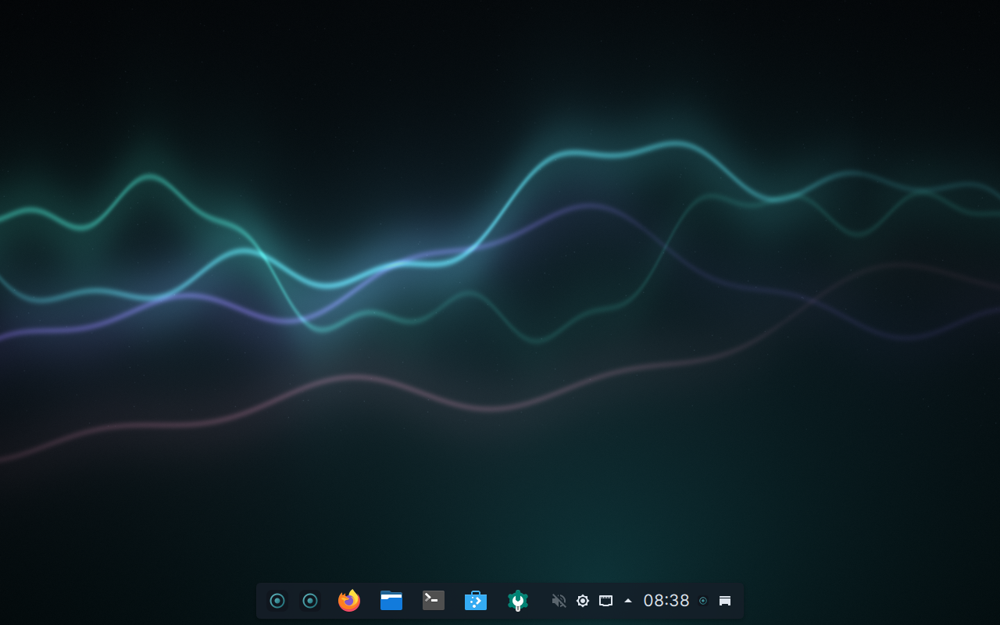
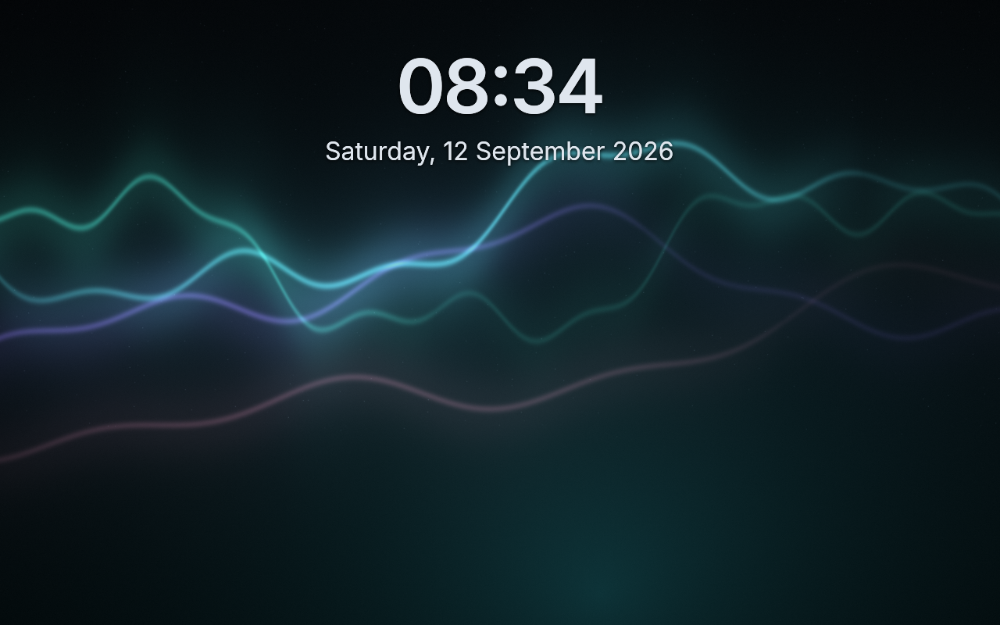
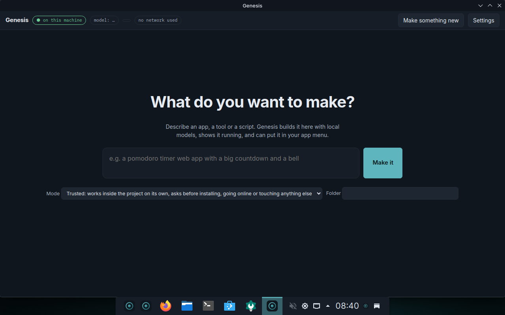
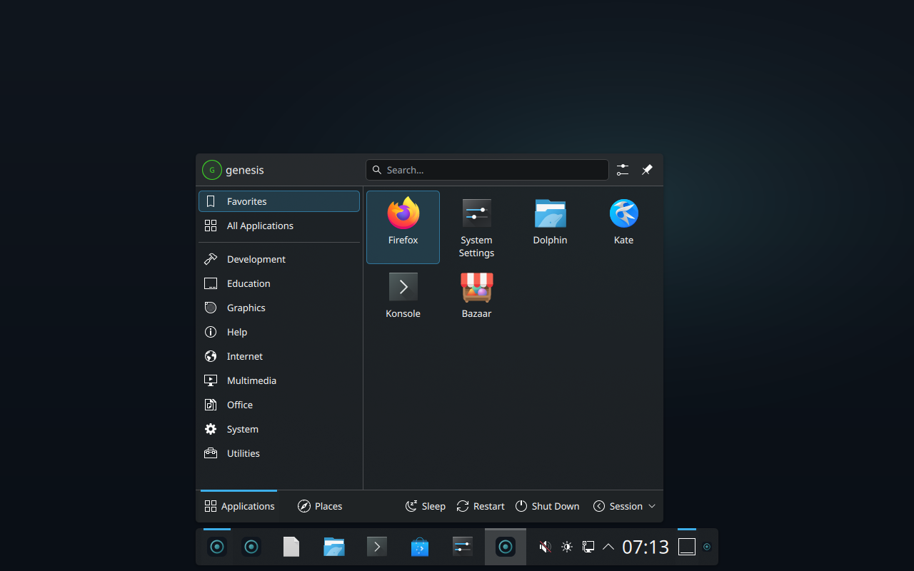

# Genesis

**A complete Linux desktop that can build things for you, with AI that runs on your machine.**

Genesis is its own distribution, derived from Fedora bootc (Universal Blue Aurora, KDE Plasma 6).
It ships a full desktop: browser, files, terminal, documents, photos, music, video, calculator,
app store, office, mail. On top of that it has a **maker**: press `Meta+Space`, type or say what you
want made, and it builds it, shows it live, and installs it to your app menu. It can drive its own
private browser, listen to your voice and talk back. Nothing leaves the computer. Every change is
permission-gated and undoable.

| | |
|---|---|
|  |  |
| The desktop, release v0.1.47 booted in QEMU | The login screen, same boot |
|  |  |
| The maker, opened after first run | The application menu (v0.1.34 session) |

Automatic screenshots from the latest release: [docs/screens/latest](docs/screens/latest). Phone pairing and replies, captured in the VM with an Android emulator: [docs/screens/phone](docs/screens/phone). Preview renderings: [docs/screens/preview](docs/screens/preview).

<p align="center"> </p>
What changed in each release: [Releases](../../releases) (notes are generated from the commits).
Design brief: [docs/genesis-brief.html](docs/genesis-brief.html) · Design plan: [docs/genesis-design-plan.html](docs/genesis-design-plan.html)
· Decision log: [docs/decisions.md](docs/decisions.md) · Walkthrough: [docs/genesis-walkthrough.html](docs/genesis-walkthrough.html).

## What works today (v0.1.34 and the next release)

- **Bootable image and installer ISO**, built and boot-tested in CI on every push; releases carry a
  qcow2 disk and the ISO ([Releases](../../releases)).
- **Complete desktop**: KDE Plasma 6 with Firefox, Dolphin, Konsole, Kate, Okular, Gwenview, Haruna,
  Elisa, KCalc, Discover (Flatpak), Ark, Spectacle, System Monitor as RPMs; LibreOffice, Thunderbird,
  VLC, GIMP, Krita preinstalled as Flatpaks once online. Genesis identity: Genesis Dark colour scheme,
  "First Light" wallpaper, Inter and IBM Plex Mono, Papirus icons, a centered floating dock, splash and
  boot watermark, login screen.
- **Local models as an OS service**: llama.cpp (Vulkan) behind llama-swap on `127.0.0.1:8080`,
  one OpenAI-compatible endpoint; model packs per hardware tier (`packs/`), chosen at first run.
- **First-run wizard** (`genesis-firstrun`): detects GPU, RAM and disk (`genesis-probe`), shows every
  pack with "fits your machine" bars for memory and disk, proposes one, downloads it, or lets you set
  models up later.
- **Maker** (`genesis-agentd` + `genesis-window`): "what do you want to make?" → template → files →
  live preview → steer → install as app. Starter prompts, plain-language permission prompts, a
  Keep / Undo toast, a "Made here" gallery with shareable recipes and one-click export bundles, and
  proactive cards for projects that failed their last run or were never installed. Small models get a compact
  mode with a short strict script; the wizard says what each pack can do on this hardware. Templates: static web app,
  Python CLI, Python script.
- **Permission broker** (`genesis-permd`): every tool call classified into tiers (read, write in
  project, write elsewhere, system, secrets, never) and answered per session mode
  (assist / auto-edit / autonomous). Hash-chained audit log. D-Bus `org.genesis.Permission1`.
- **Undo** (`genesis-txd`): snapshots (btrfs or file pre-images) before risky changes;
  `genesis-txd undo`.
- **One door**: `Meta+Space` opens the palette, a small centered window that takes a typed request,
  a spoken one (hold the mic), or the current selection (`Meta+Shift+Space`), and hands it to the maker.
  `ask …` also works in KRunner.
- **Genesis in System Settings** (a native module) and **Genesis Settings** (the same in the Genesis window): the
  machine, models on disk, updates, the default autonomy
  mode (Ask / Trusted / Hands-off), voice readiness, the measured tokens per second, the undo history,
  and a Day / Night switch for the whole desktop (also `Meta+Shift+T`).
- **Status widget** in the dock: model loaded, whether any job used the network, sandbox on, one click
  to the maker.
- **Browser control**: the agent drives a headless Chromium with a throw-away profile (open, read,
  click, type, screenshot). Page content is treated as untrusted and taints the session.
- **Terminal**: `ask list the ten biggest files here` prints the command, says what it would touch
  (reads only, changes files here, changes the system), and runs it when you confirm. In bash, type a
  sentence and press `Ctrl+G` to replace it with the command.
- **Voice**: hold-to-talk (whisper.cpp; the more accurate "small" model on machines with 16 GB or a GPU) with a
  chime and glow the instant you press, and spoken replies (Piper, English for now), all local.
- **Ask about the screen**: Meta+Shift+Space, select a region, ask; the local vision model answers (every pack
  ships a vision projector from 0.1.103). Notification and clipboard, nothing leaves the machine.
- **Your files, on request**: opt folders in under Settings and the maker can search your notes, documents,
  PDFs and code ("what did I write about the trip?"). A local SQLite index, refreshed every 20 minutes.
- **Signed model packs**: pack definitions are OCI artifacts on GHCR, signed with the Genesis key and
  verified by the same containers policy as the OS; every model download is checked against the sha256
  in the signed definition. Built-in definitions remain the offline fallback.
- **Phone**: pair once with KDE Connect (first run has a step for it, with the same code on both screens).
  Notifications, clipboard and files both ways. Share text to Genesis starting with "ask" and the local
  model answers as a phone notification; "make …" starts the maker on the desktop. Voice notes sent to Genesis are
  transcribed and answered the same way. The phone also gets commands: day / night, lock, apply the
  staged update; the palette shows the phone's notifications and can reply to those that allow it.
  Same network only, no relay, no cloud.
- **Languages**: the palette, the maker and the wizard follow the system language; English, German and
  Slovenian today, and a language is one dictionary in the page.

## A real run

[examples/checklist-in-vm](examples/checklist-in-vm) is the maker working inside Genesis itself: "a checklist app
that saves to a file" became a tested CLI in 17 turns, bugs found and fixed by the model along the way.

## Try it

Download page: https://matijagorsek.github.io/genesis/ (latest release, the right file per platform).
Images are signed with sigstore; verify with `cosign verify --certificate-identity-regexp github.com/matijagorsek/genesis --certificate-oidc-issuer https://token.actions.githubusercontent.com ghcr.io/matijagorsek/genesis:<tag>`.

Download the latest `genesis-<version>.qcow2.zst.*.part` files from a release, join and boot:

```bash
cat genesis-*.qcow2.zst.*.part | zstd -d -o disk.qcow2
just boot iso/output/disk.qcow2        # QEMU, EFI; test user genesis / genesis
qemu-img resize disk.qcow2 40G         # optional: room for a bigger model pack; the root grows on boot
```

Or install from the ISO in a VM (UTM, virt-manager, VirtualBox) or on a spare machine. On an NVIDIA machine,
switch to the NVIDIA flavour afterwards: `sudo bootc switch ghcr.io/matijagorsek/genesis:stable-nvidia`.

**On an Apple Silicon Mac**, use the arm64 flavour, which runs natively under Apple's hypervisor at
full speed, models included: download the `genesis-<version>-arm64.qcow2.zst.*.part` files, join them
the same way, and run `just vm-dev-arm`. The arm64 flavour is Genesis on plain Fedora bootc with the
Plasma desktop installed by the image (Aurora, the x86_64 base, publishes no arm64 image). Measured on
an M4 Max: boot to login under a minute, first model reply in about 10 seconds, about 6 tokens/s on the tiny
pack on the CPU, `ask` answers in about 7 seconds.

## Develop

Fast loop, no image build:

```bash
just vm-dev            # boots the last downloaded disk with a window and SSH (port 2222); the VM has
                       # internet, so the wizard can download the tiny pack. On Apple Silicon this VM is
                       # emulated x86_64: the desktop is fine, model answers take minutes (see decision 45)
just vm-push           # cross-compiles the daemons in Docker and copies them into the running VM
prototype/serial-cmd.py iso/output/dev/serial.sock 'cmd'   # run commands over the serial console
just firstrun          # the wizard, natively on this Mac, at http://127.0.0.1:11510
just workspace         # the maker, natively, at http://127.0.0.1:11520 (needs `just up`)
just vm-bridge         # dev only: the VM uses the Mac's Metal model service for the maker and `ask`
cd src && cargo test   # Rust workspace: permd, probe, firstrun, agentd, txd, krunner, ask
```

Full image, locally (emulated on Apple Silicon, slow) or in CI (every push to `main`):

```bash
just image             # podman/docker build of the bootc image
just iso               # installer ISO via bootc-image-builder
```

CI (`.github/workflows/build-image.yml`): Rust tests and policy diff → image build (strict
`bootc container lint`, ~45 image self-checks) → push to GHCR → qcow2 → KVM boot test → release.

## Layout

```
Containerfile        the OS image: Rust daemons (cross-compiled), Qt window, whisper.cpp, Piper,
                     llama.cpp, llama-swap, desktop apps, Genesis system files
system_files/        what ships in the image: systemd units, policy, look-and-feel, wallpaper,
                     login defaults, Flatpak preinstall list, image self-check
src/                 Rust workspace: genesis-permd, -probe, -firstrun, -agentd, -txd, -krunner,
                     and genesis-window (C++/Qt WebEngine)
packs/               model packs per hardware tier (JSON, schema.json)
templates/           maker templates (genesis.json: dev/run commands)
iso/                 bootc-image-builder config and distro definition
prototype/           macOS dev scripts, router config, VM boot/screenshot/dev-loop scripts
docs/                brief, decisions, status board, previews, screenshots
examples/            recorded real runs (Phase 0 tasks, gated install, pomodoro app)
```

## Optional: Claude, with your own account

Genesis includes **Claude Code**, Anthropic's terminal agent, as a separate optional app: "Claude" in the app
menu, "Open Claude" in Genesis Settings, "Open in Claude" on every made project. The first start installs it
into your home folder and asks you to sign in with your Claude account in the terminal. No API keys. Genesis'
own maker, palette and `ask` stay local.

## Security and privacy, in one place

- **Local by default.** The maker, the palette, voice and `ask` use models on this machine. The only network
  use is what a job asks for and you allow (a package install, a web page), and every job lists it.
- **Claude is optional and separate.** Claude Code signs in with your account in the terminal; its credentials
  live in your home folder under `~/.claude`, Genesis never reads them, and they never touch this repository
  or the image. There are no API keys anywhere in Genesis.
- **A closed front door.** The local daemons answer only their own pages and local helpers: same-origin
  checks plus a per-boot token, so a web page open in the browser cannot drive the maker; request
  bodies are capped and file opening is limited to what Genesis made. Reviewed adversarially (decision 70).
- **Reviewed rules.** The permission policy is exercised by an adversarial test battery (keys read through a
  shell, login files, code piped from the network, disk wipes); every rule change must keep it green.
- **Nothing secret in git.** CI fails if a credential-like string is committed; disks, run logs and local
  state are ignored. Model weights are downloaded at first run, never shipped.
- **Signed images, enforced.** Every pushed image is signed twice: keyless with the GitHub identity (verify
  with the `cosign` command above) and with the Genesis release key. Installed systems ship the public key
  and a container policy that refuses unsigned or tampered updates.
- **Updates you control.** Updates stage in the background and apply at the next restart; Genesis never
  restarts on its own.

## Contributing, licence, reporting

[CONTRIBUTING.md](CONTRIBUTING.md) for the workflow, [SECURITY.md](SECURITY.md) for reporting vulnerabilities,
[CODE_OF_CONDUCT.md](CODE_OF_CONDUCT.md). Genesis is Apache-2.0 ([LICENSE](LICENSE)); redistributed components and
their licences are listed in [NOTICE](NOTICE). Ran it on real hardware? Open a "Hardware report" issue.

## Principles

1. A complete desktop first; AI is one integrated capability, not the point of the desktop.
2. Local by default. No account, no cloud, no telemetry.
3. Ask before touching the system; record everything; make it undoable.
4. Web content is data, never instructions.
5. The base is a swappable `FROM`; Genesis is the layer on top.

Genesis is a Fedora Remix and is not endorsed by the Fedora Project.
